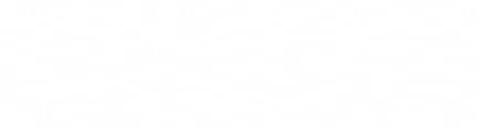
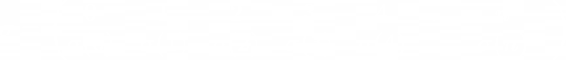
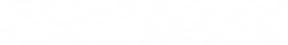

# QCS

QCS (Quantum Circuit Synthesis) - консольная программа для синтеза квантовых схем.

Реализована студентом ИУ8 Макрецким Петром в рамках дипломной работы.

## Описание

Программа QCS (Quantum Circuit Synthesis) предназначена для синтеза квантовых схем по заданным отображениям. Программа
имеет два режима работа: прямой и обратный.

Минимальность выходных схем не гарантируется.

Наилучшее время работы программы и оптимальное использование памяти программой не гарантируется.

* Прямой режим работы предназначен для синтеза схем: на вход подается отображение в форме таблицы истинности векторной
  функции или подстановки. Для синтеза доступно два алгоритма: основанный на построении АНФ координатных функций данного
  отображения и основанный на использовании спектра Радемахера-Уолша координатных функций отображения
* Обратный режим работы (реверсный) предназначен для восстановления подстановки из квантовой схемы

Входные данные подаются в вида файла. Выходные данные могут быть записаны в стандартный поток вывода или в файл

## Основные параметры

* `--help` или `-h` печатает основную информацию, другие аргументы игнорируются

```bash
./qcs --help
QCS v1.1.0
(c) Peter Makretskiy, IU8 BMSTU, 2025.
Program for synthesizing quantum circuits from mapping

Generic options:
  -V, --version       print version
  -h, --help          produce help message
  -l, --log ARG       minimum level of logging: 'DEBUG', 'INFO', 'WARNING', 'ERROR', 'CRITICAL' (default: 'ERROR')

Operating modes:
  -t, --type ARG      type of input ('tt' - truth table, 'sub' - substitution, 'qc' - quantum circuit)

Synthesis options:
  -a, --algo ARG      algorithm to synthesis quantum circuit ('dummy', 'rw')
  -r, --reduction     reduce the output circuit (default: false)

Parameters:
  -i, --input ARG     path to input file
  -o, --output ARG    path to output file (default: prints into standard output)
```

* `--version` или `-V` печатает версию программы, другие аргументы игнорируются

```bash
./qcs --version
1.1.0
```

* `-l arg` или `--log arg` устанавливает максимальный уровень логирования. Опциональный параметр, значение по умолчанию
  `ERROR`. Аргумент обязательный. Допустимые значения аргумента:
    * `DEBUG` - информация для отладки;
    * `INFO` - информационные сообщения;
    * `WARNING` - предупреждения;
    * `ERROR` - ошибки;
    * `CRITICAL` - критические ошибки.

* `-t arg` или `--type arg` определяет тип входных данных, то есть режим работы: прямой или обратный. Обязательный
  параметр. Аргумент обязательный. Допустимые значения аргумента:
    * `qc` - квантовая схема в требуемом [формате](#пример);
    * `tt` - таблица истинности двоичного отображения в требуемом [формате](#пример-1);
    * `sub` - подстановка в требуемом [формате](#пример-2).

* `-a arg` или `--algo arg` определяет алгоритм синтеза квантовой схемы. Обязательный параметр в прямом режиме работы. В
  обратном режиме работа недопустимо. Аргумент обязательный. Допустимые значения аргумента:
    * `dummy` - алгоритм независимого построения каждой координатной функции отображения;
    * `rw` - алгоритм, основанный на спектре Радемахера-Уолша координатных функций отображения.

* `-r` или `--reduction` (**экспериментальная опция**) определяет, будет ли итоговая схема упрощена. Опциональный
  параметр. Недопустим в обратном режиме работы.

* `-i arg` или `--input arg` определяет путь к файлу с входными данными. Обязательный параметр. Аргумент обязательный.

* `-o arg` или `--output arg` определяет путь к файлу, в который будет записан результат вычисления. Опциональный
  параметр. По умолчанию вывод записывается в стандартный поток вывода. Аргумент обязательный. Если выбранный файл уже
  существует, он может быть перезаписан или вывод будет записан в стандартный поток вывода - по выбору пользователя.

## Описание входных данных

### Квантовая схема (`qc`)

Общий формат квантовой схемы описывается следующим образом:

```angular2html
Lines: num[;lines of additional memory]
[Gate1(param1, param2; param3, param4)]
[Gate2(param1, param2; param3, param4)]
...
```

В первой строке указывается число линий схемы (натуральное число), при необходимости через точку запятой вводится число
линий дополнительной памяти. Линии дополнительной памяти будут располагаться внизу. Количество линий дополнительной
памяти должно быть меньше чем `num`. Далее могут быть перечислены вентили схемы (по одному на каждую строку). Линии
схемы нумеруются от нуля.

Вентиль должен быть записан в представленном формате:
`ИМЯ(управляемые линии через запятую; управляющие линии через запятую)`

Не чувствительно к регистру.
Допускаются комментарии: строка начинается с символа `#`.
Числа могут быть указаны в десятичной (`0, ..., 9`), шестнадцатеричной (`A, ..., F` или `0x1, ..., 0xab9, ...`)
системах.

Инвертированные контролирующие входы помещаются символом "!" перед номером.

#### Пример:

```angular2html
# Схема из 5 линий, две нижние из которых - линии дополнительной памяти
Lines: 5; 2
# Вентиль Феймана
CNOT(2; 1)
# Обобщенный вентиль Тоффоли с инвертированными входами 1 и 2
kCNOT(4; 0, !1, !2, 3)
SWAP(2, 3)
# Вентиль Фредкина
CSWAP(3, 4; 1)
```

Квантовая схема с дополнительной памятью в обратном режиме работы будет восстановлена в двоичное отображение, которое не
обязано являться обратимым.

### Таблица истинности двоичного отображения (`tt`)

Общий формат двоичного отображения $F:\mathbb{Z}_2^n\to\mathbb{Z}_2^m$, представленного в виде векторной
функции $F=(f_1, ..., f_m)$, где $\forall f_i:\mathbb{Z}_2^n\to\mathbb{Z}_2$, выглядит следующим образом:



Допускаются комментарии: строка начинается с символа `#`.

#### Пример:

Для $F=(0110, 0110, 1001, 0100)$:

```angular2html
# Truth table
0 0 1 0
1 1 0 1
1 1 0 0
0 0 1 0
```

Квантовая схема, построенная по двоичному отображению, которое не является обратимым, будет иметь дополнительную память.
Линии дополнительной памяти будут расположены снизу. Для необратимого двоичного
отображения $F:\mathbb{Z}_2^n\to\mathbb{Z}_2^m$ будет $m$ линий дополнительной памяти, $n$ первых выходов будут
мусорными.

### Подстановка (`sub`)

Общий формат двоичного отображения



определяется строкой его образов (то есть второй строкой).

Допускаются комментарии: строка начинается с символа `#`.
Числа могут указывать в десятичной (`0, ..., 9`), шестнадцатеричной (`A, ..., F` или `0x1, ..., 0xab9, ...`) системах.

#### Пример:

Для



```angular2html
# Images
0 2 5 7 6 1 3 4
```

По подстановке, степень которой не является степенью двойки, невозможно построить квантовую схему.

## Пример работы

1. Обратный режим работы:

   Запуск программы в обратном режиме: восстановление квантовой схемы, записанной в файл `circuit.txt`, в отображение,
   которое будет записано в файл `mapping.txt`, уровень логирования `INFO`. Если данная квантовая схема не имеет
   дополнительной памяти, отображение будет записано в виде подстановки, иначе - в виде таблицы истинности двоичного
   отображения.

```bash
./qcs --type qc --input "circuit.txt" --output "mapping.txt" --log INFO
```

2. Синтез схемы:

   Запуск программы в прямом режиме работы: синтез квантовой схемы по алгоритму, основанному на использовании спектра
   Радемахера-Уолша, которая будет выведена в стандартный поток вывода, реализующей двоичное отображение, записанное в
   файл `truth_table.txt`, режим логирования - по умолчанию - `ERROR`, итоговая схема будет упрощена. Если данное
   двоичное отображение необратимо, выходная квантовая схема будет иметь дополнительную память.

```bash
./qcs --type tt --algo rw --input "truth_table.txt" --reduction
```

## Запуск тестов

```bash
./tests
```
